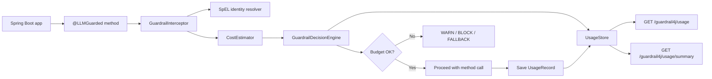
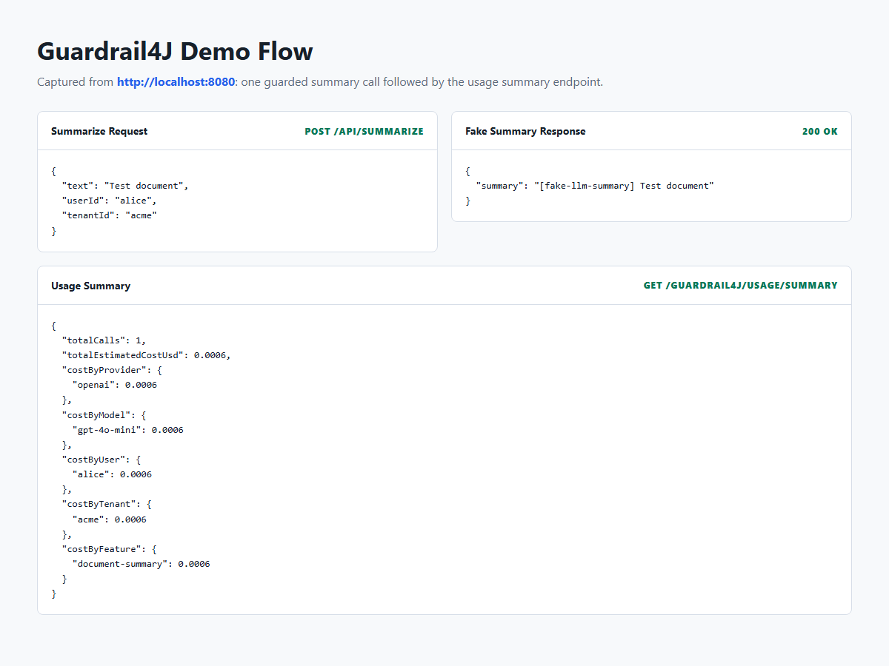

# Guardrail4J

**A Spring Boot starter for keeping LLM usage inside budget.**

[](https://github.com/AbaSheger/guardrail4j/actions/workflows/ci.yml)
[](https://openjdk.org/projects/jdk/21/)
[](https://spring.io/projects/spring-boot)
[](https://maven.apache.org/)
[](LICENSE)

When AI features are billed per token, one heavy user can cost more than they
pay you. Guardrail4J lets Java and Spring teams add budget checks around LLM
calls with one annotation.

```java
@LLMGuarded(
    userId = "#userId",
    tenantId = "#tenantId",
    onViolation = GuardrailAction.BLOCK
)
public String summarize(String text, String userId, String tenantId) {
    return openAiClient.complete(text);
}
```

Guardrail4J estimates cost before the method runs, checks configured budgets,
records allowed usage, and decides whether to `ALLOW`, `WARN`, `BLOCK`, or
suggest `FALLBACK`.

[Watch the short social demo](docs/social-demo/guardrail4j-demo.mp4)

> **Status:** Early MVP. Good for experimentation and local development. Not
> production-ready yet. See [Current Limitations](#current-limitations) and
> [Roadmap](ROADMAP.md).

---

## Why It Exists

Traditional SaaS usage is often bounded by compute, storage, or seats. LLM
features add a direct variable cost per request. A customer on a fixed plan can
become unprofitable if prompt sizes, output sizes, retries, agents, or abusive
usage are not controlled.

Guardrail4J gives Spring Boot apps a lightweight way to enforce cost controls
without replacing your LLM SDK or rewriting your application flow.

- Add `@LLMGuarded` to existing LLM-calling methods
- Configure daily, monthly, per-user, and per-tenant budgets
- Track spend by provider, model, user, tenant, and feature
- Resolve `userId` and `tenantId` dynamically with SpEL
- Expose usage through simple REST endpoints
- Keep provider SDK choice outside the guardrail layer

---

## What It Does

| Capability | Current support |
|------------|-----------------|
| Method guardrail | `@LLMGuarded` annotation with Spring AOP interception |
| Decisions | `ALLOW`, `WARN`, `BLOCK`, `FALLBACK` |
| Budget scopes | Daily, monthly, per-user daily, per-tenant monthly |
| Cost model | Configurable provider/model price table |
| Identity | Static values or SpEL expressions such as `#userId`, `#tenantId`, `#p0` |
| Storage | In-memory `UsageStore`, replaceable with your own bean |
| Monitoring | `/guardrail4j/health`, `/guardrail4j/usage`, `/guardrail4j/usage/summary` |

---

## Quick Start

### 1. Add the dependency

```xml
<dependency>
  <groupId>io.github.abasheger</groupId>
  <artifactId>guardrail4j-spring-boot-starter</artifactId>
  <version>0.1.0-SNAPSHOT</version>
</dependency>
```

### 2. Annotate an LLM method

```java
import io.github.abasheger.guardrail4j.annotation.LLMGuarded;
import io.github.abasheger.guardrail4j.model.GuardrailAction;

@LLMGuarded(
    provider = "openai",
    model = "gpt-4o-mini",
    userId = "#userId",
    tenantId = "#tenantId",
    feature = "document-summary",
    estimatedInputTokens = 2000,
    estimatedOutputTokens = 500,
    onViolation = GuardrailAction.BLOCK
)
public String summarizeDocument(String text, String userId, String tenantId) {
    // Your existing LLM call stays here.
    return openAiClient.complete(text);
}
```

`userId` and `tenantId` can be literal strings or Spring Expression Language
references to method arguments. Positional references such as `#p0` and `#p1`
also work when parameter names are unavailable.

### 3. Configure budgets

```yaml
guardrail4j:
  enabled: true
  defaultAction: WARN          # WARN | BLOCK | FALLBACK
  dailyBudgetUsd: 5.00
  monthlyBudgetUsd: 50.00
  perUserDailyBudgetUsd: 1.00
  perTenantMonthlyBudgetUsd: 15.00
  fallbackModel: gpt-4o-mini
  pricing:
    openai:gpt-4o-mini:
      inputPer1MUsd: 0.15
      outputPer1MUsd: 0.60
    anthropic:claude-3-5-haiku:
      inputPer1MUsd: 0.25
      outputPer1MUsd: 1.25
```

Disable Guardrail4J without removing the dependency:

```yaml
guardrail4j:
  enabled: false
```

---

## How It Works



Flow:

1. A method annotated with `@LLMGuarded` is called.
2. Spring AOP intercepts the call before your method body runs.
3. Guardrail4J resolves `userId` and `tenantId`.
4. `CostEstimator` estimates the request cost from provider/model pricing.
5. `GuardrailDecisionEngine` checks configured budgets.
6. The call is allowed, warned, blocked, or marked for fallback.
7. Successful guarded calls are recorded in `UsageStore`.
8. Usage data is exposed through REST monitoring endpoints.

The starter stays outside the provider SDK. It does not require OpenAI,
Anthropic, LangChain4j, Spring AI, or any specific client.

---

## Monitoring Endpoints

These endpoints are available automatically when the app is a web application.

| Endpoint | Description |
|----------|-------------|
| `GET /guardrail4j/health` | Returns enabled status and total usage record count |
| `GET /guardrail4j/usage` | Returns recorded `UsageRecord` entries |
| `GET /guardrail4j/usage/summary` | Returns total calls and estimated cost grouped by provider, model, user, tenant, and feature |

Example summary response:

```json
{
  "totalCalls": 2,
  "totalEstimatedCostUsd": 0.00126,
  "costByProvider": {
    "openai": 0.00126
  },
  "costByModel": {
    "gpt-4o-mini": 0.00126
  },
  "costByUser": {
    "alice": 0.00063,
    "bob": 0.00063
  },
  "costByTenant": {
    "acme": 0.00126
  },
  "costByFeature": {
    "document-summary": 0.00126
  }
}
```

When a guarded call is blocked, Guardrail4J throws
`GuardrailViolationException`. Applications can catch it and return their own
API response. The demo app returns HTTP 429:

```json
{
  "error": "GUARDRAIL_BLOCKED",
  "message": "Guardrail4J blocked this LLM call due to budget limits",
  "decision": "BLOCK",
  "provider": "openai",
  "model": "gpt-4o-mini",
  "userId": "alice",
  "tenantId": "acme",
  "feature": "document-summary"
}
```

---

## Running the Demo

```bash
# Build and run tests
mvn clean verify

# Install local modules so the demo can resolve the starter dependency
mvn -DskipTests install

# Start the demo app on port 8080
mvn -pl guardrail4j-demo spring-boot:run
```

Make a guarded request:

```bash
curl -X POST http://localhost:8080/api/summarize \
  -H "Content-Type: application/json" \
  -d '{
    "text": "Spring Boot simplifies production-ready Java applications.",
    "userId": "alice",
    "tenantId": "acme"
  }'
```

Inspect usage:

```bash
curl http://localhost:8080/guardrail4j/usage
curl http://localhost:8080/guardrail4j/usage/summary
```

### Demo Assets

Install the JavaScript tooling once:

```bash
npm install
```

Capture the demo app screenshot:

```bash
npm run demo:capture
```

Requires the demo app to be running. Output: `docs/demo-summary.png`



Generate the LinkedIn/social demo video:

```bash
npm run social:capture
```

Output: `docs/social-demo/guardrail4j-demo.mp4`

---

## Storage and Scaling

The default `UsageStore` is in-memory. This keeps setup simple for local demos,
but it has important production implications:

- Usage data is lost when the app restarts.
- Each app instance has its own usage state.
- Horizontally scaled deployments may calculate budgets incorrectly because
  instances cannot see each other's usage.

Future PostgreSQL and Redis-backed stores are planned. Until then, production
deployments should provide a shared persistent implementation by defining their
own Spring bean. Guardrail4J auto-configuration uses
`@ConditionalOnMissingBean`, so your bean replaces the default store.

```java
import io.github.abasheger.guardrail4j.store.UsageStore;
import org.springframework.context.annotation.Bean;
import org.springframework.context.annotation.Configuration;

@Configuration
class CustomUsageStoreConfig {
    @Bean
    UsageStore usageStore() {
        return new MyPersistentUsageStore();
    }
}
```

---

## Annotation Reference

| Field | Default | Description |
|-------|---------|-------------|
| `provider` | `"openai"` | Provider key for price lookup |
| `model` | `"gpt-4o-mini"` | Model key for price lookup |
| `userId` | `"anonymous"` | User identifier; supports SpEL such as `#userId` |
| `tenantId` | `"default"` | Tenant identifier; supports SpEL such as `#tenantId` |
| `feature` | `"general"` | Feature tag for usage records |
| `estimatedInputTokens` | `1000` | Estimated prompt tokens |
| `estimatedOutputTokens` | `250` | Estimated completion tokens |
| `onViolation` | `WARN` | Action on budget breach: `WARN`, `BLOCK`, `FALLBACK` |
| `fallbackModel` | `""` | Suggested fallback model, logged only in the current MVP |

---

## Current Limitations

Guardrail4J is an early MVP. Be aware of these constraints before using it for
serious production enforcement:

- **In-memory storage only:** usage data is lost on restart and not shared
  across app instances.
- **Estimated token counts:** cost is based on annotation fields, not actual
  provider response usage.
- **No provider interception:** the starter guards your annotated method but
  does not make or proxy real LLM API calls.
- **Advisory fallback:** `FALLBACK` records/logs the decision but does not
  automatically switch provider or model yet.
- **Limited policy model:** current budgets are flat daily/monthly/user/tenant
  thresholds.

---

## Roadmap

See [ROADMAP.md](ROADMAP.md) for the full plan.

| Version | Theme |
|---------|-------|
| v0.1 | MVP: annotation, in-memory budgets, cost estimation |
| v0.2 | Persistent storage and horizontal scaling |
| v0.3 | Dynamic identity and better observability |
| v0.4 | Micrometer metrics integration |
| Future | Provider adapters, real fallback execution, hosted dashboard, richer policy DSL |

---

## Contributing

See [CONTRIBUTING.md](CONTRIBUTING.md). Feedback on the API shape, examples,
tests, and storage backends is especially useful.

---

## License

[MIT](LICENSE)
